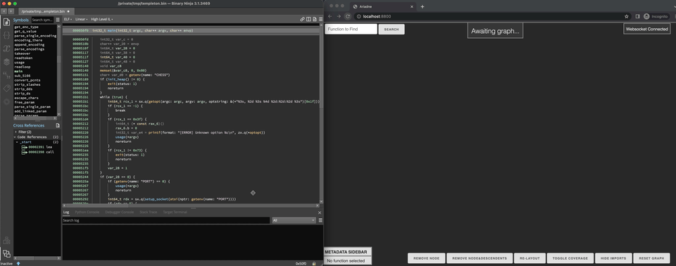
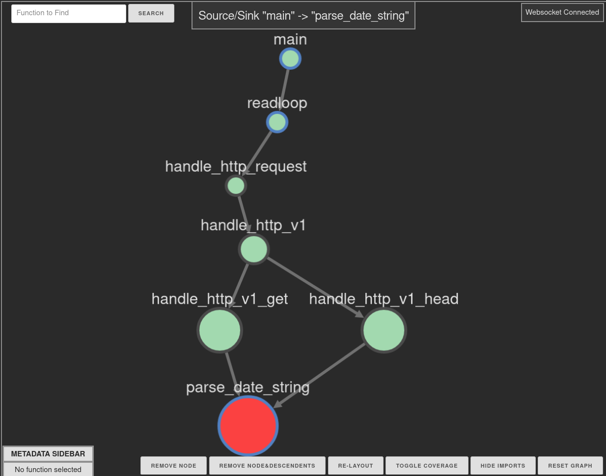
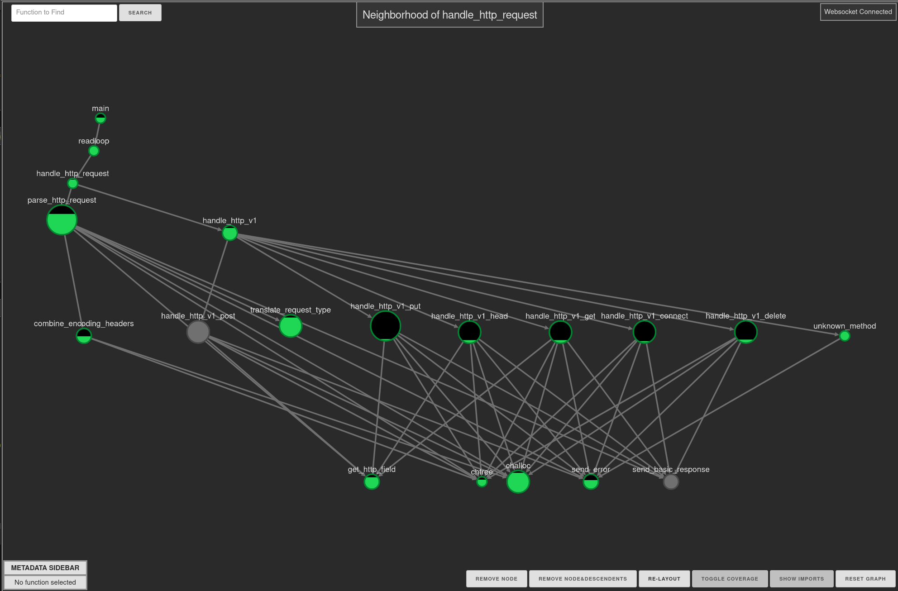
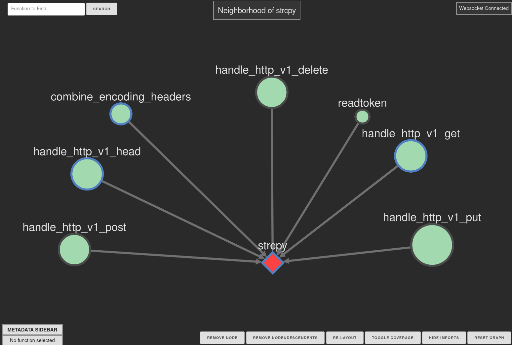
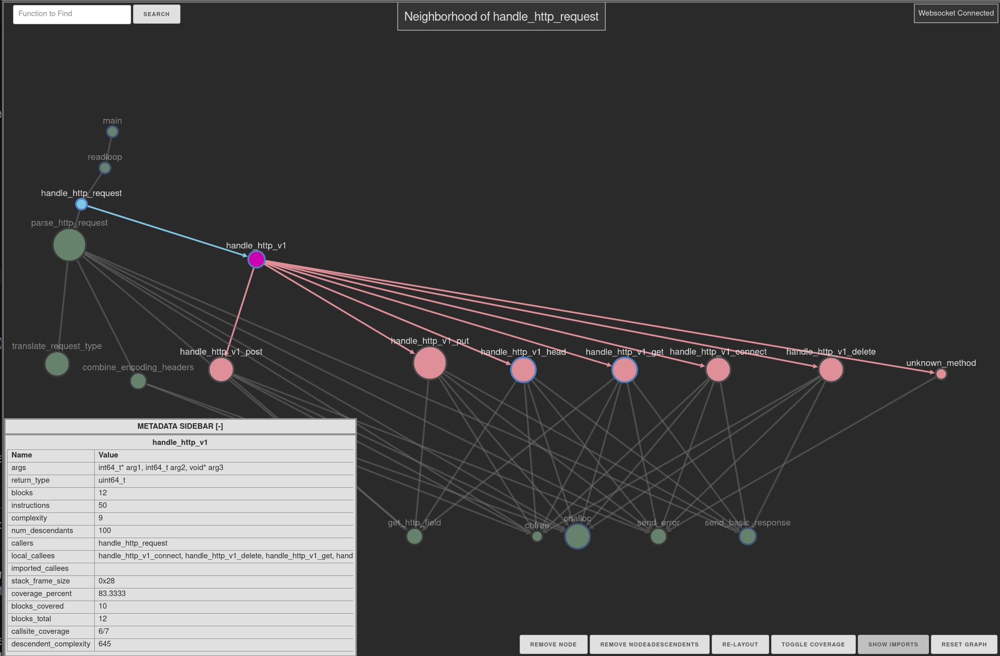

# Ariadne: Binary Ninja Graph Analysis Plugin

Ariadne is a Binary Ninja plugin that serves a browser-based interactive graph
visualization for assisting reverse engineers. It implements some common static
analysis tasks including call graph analysis, and can integrate block coverage
information. This enables users to build interactive graphs and see exactly what
they are interested in.

## Quickstart

1. Install this plugin via the Plugin Manager or clone this repo to your Binary
  Ninja [plugins folder](https://docs.binary.ninja/getting-started.html#user-folder)
  - NOTE: If you install by cloning the repo, you may need to install the Python
  dependencies in `requirements.txt`. Use the command palette (`CTRL+P` or
  equivalent) to do `Install Python3 module` and copy the contents of
  requirements.txt into the dialog.
2. Open a binary in Binary Ninja
3. Right click: Plugins > Ariadne > Analyze Target
4. Watch the log and wait for analysis to complete
5. Open a browser and surf to `http://localhost:8800` to view the interactive
   graph (web UI)
6. Navigate around in Binary Ninja; the graph will update when the current
   function changes

## Graph Styling

The quick rundown on what the shapes and colors on the graph mean:

- Regular functions are green circles
- Import functions are diamond-shaped and colored orange
- Node size is based on cyclomatic complexity; more complex functions are
  bigger circles
- The current function active in BN is colored red
- Nodes with double borders mean they have edges that weren't included for the
  current graph (default: local neighborhood for active function in BN, see note
  below)
- Functions that you've looked at in the BN UI have light blue borders
- If you click on a node, it becomes the focus node
  - The focus node is colored purple
  - Out edges/nodes (callees) are colored pink
  - In edges/nodes (calleRs) are colored blue
  - Clicking on the focus node deselects it
  - Clicking on another node makes that node the focus node

NOTE: the default graph is a 2-hop neighborhood of the current function _BUT_ it
will be automatically pruned to a smaller graph if two hops would include too
many nodes. Use the context menu function graph to push the full context for
the current function or use
[networkx](https://networkx.org/) to build custom graphs and push them to
the web UI.

## Motivation

This tool is a proof-of-concept that was built to fill a gap that we observed in
our own reverse-engineering workflows, with the goals of being highly
configurable and to help make reverse-engineering faster.

The key insight we found building/using a graph tool is that looking at too many
nodes is unhelpful and layout matters a lot, so we focused on just the analysis
results we wanted in the smallest and cleanest view possible.

From there, we built the backend so any graph could be pushed to the backend and
common graph tasks would be easy. Adding extra analysis tasks is also easy since
there are places for per-function and target-wide analysis.

## Common Workflows

- Source/Sink analysis: Context command allows you to select a function and see
  all the paths to/from the current function in the web UI. 
- Coverage analysis via [bncov](https://github.com/ForAllSecure/bncov): allows
  visualization of coverage and shows where your coverage stops and uncovered
  complexity resides. Requires bncov, but if coverage information is detected
  before analysis starts it will automatically be added, or it can be added
  separately. 
  - The Descendent Complexity statistics ("total" as well as "uncovered") show
    the sum of complexity for all functions reachable from a given function as
    well as the sum for just functions with zero coverage. Very useful for
    fuzzing!
- Import Hiding: Sometimes imports are helpful, other times they just convolute
  the graph because it's more important to see just the internal functions
- Custom graphs: create any graph based on the target's graph (`ariadne.core.targets[bv].g`) and push it to the web UI with `ariadne.core.push_new_graph(new_graph)`
- Standard styling: the default graph styling allows you to see which functions
  you have already looked at, which functions are imports, and caller/callee
  relationships. Helps you see which functions you haven't looked at that may be
  of interest. 
- Collapsible Function Metadata sidebar: Shows all the relevant static analysis
  results for any function you click on. 
- Function search bar: start typing the name of the function you want to find in
  the search bar in the upper left, when the name turns green you can stop
  typing and hit enter to center the graph on the target function.
- Freezing/unfreezing the graph: sometimes you don't want auto-updates
- Save/Load analysis: redoing analysis is no good; headless analysis and
  save/load features allow you to crunch binaries on a separate machine if you
  want.

See the [tutorial](./tutorial/README.md) for detailed explanation of features
and intended workflows that you can test out on an example binary.

## Troubleshooting

If the web UI is unresponsive, check the websocket status in the upper right
corner. If you push a really large graph to the web UI, the page may freeze
while the graph layout is computed. In any case, refreshing the page should
reset the UI.

Unhandled Python exceptions on startup or during processing are bugs and it'd be
great if you would open a GitHub issue on the repo here and describe the problem
(and include a binary to reproduce the problem, if possible).

## Thank you!

To everyone who tries out this tool, it would mean a lot to me if you reach out
and give me your thoughts on Twitter (@seeinglogic) or starring this repo. I
hope this helps you or gives you ideas on how to look at things a little
differently.
