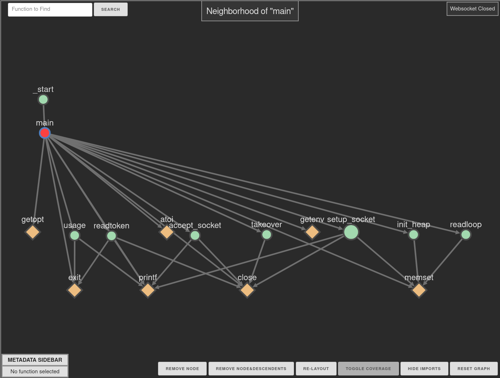

# Ariadne Tutorial

This tutorial will take you through a quick tour of the features of Ariadne.

We'll use the included `templeton.bin` as the target, which is a Linux target
built to run on Ubuntu 20.04 (but you won't need to run it to analyze it).

Before we start, make sure the plugin is installed by cloning this repo to your
plugins directory.

## Starting Analsis

Open the target in Binary Ninja, and if you see the Ariadne Function pane you
can keep it open or close it, it will update as you navigate across functions
and give you an auto-updated view of the results from the analysis tasks
(analysis metadata) for the current function. If the plugin loaded properly,
you should see a message indicating the web UI will be served on localhost (aka
`127.0.0.1`).

To start analysis, right-click in the disassembly/IL view and select Plugins > Ariadne > Analyze Target. Analysis tasks will then start and run in the
background. The status of the analysis can be viewed either by the status in
the lower left corner or in the log. While analysis is running, you should open
a browser and navigate to `http://localhost:8800`. 
We recommend splitting your
view horizontally so Binary Ninja and your browser are side-by-side so you can
see updates as you continue.

While analysis is running, the web UI will say "Graph Loading" at the top, and
a graph will be pushed when analysis completes. If you have the Ariadne Function
pane open, you should see that analysis metadata will update. Feel free to
examine the data and see if it's useful to you, but the focus of the plugin and
this tutorial is the web UI.

## Exploring the Web UI

Navigate to `main` and you should see a picture like the one below.



The color scheme on the graph is apparent in this single view and the default
rules for element (nodes and edges) styling are:

- Regular functions are green circles
- Import functions are diamond-shaped and colored orange
- Node size is based on
  [cyclomatic complexity](https://en.wikipedia.org/wiki/Cyclomatic_complexity);
  more complex functions are bigger circles
- The current function active in Binary Ninja is colored red
- Nodes with double borders mean they have edges that weren't included for the
  current graph (default: local neighborhood for active function in BN, see note
  below)
- Functions that you've looked at in the Binary Ninja UI have light blue borders
- If you click on a node, it becomes the focus node:
  - The focus node is colored purple
  - Out-directed edges/nodes (callees) are colored pink
  - In-directed edges/nodes (callERs) are colored blue
  - Clicking on the focus node deselects it
  - Clicking on another node makes that node the focus node

Starting in the upper left and going clockwise you'll see the following UI
elements/controls:

- Function search bar
- Title of current graph
- Websocket connection status
- Graph control buttons
- Metadata sidebar

We feel that each of these are straightforward enough that simple exploration
should be enough to acquaint users with the functionality. Note that the "Toggle
Coverage" button will be disabled unless coverage information was included in
the analysis.

## Interacting with the Graph

All of the nodes are clickable, and you can drag around nodes to adjust the
graph to your liking. The mouse wheel can be used to zoom in/out, and you can
always use the "Reset Graph" button to get things back to the initial view.

One of the key ideas with the adjustable graph is to allow you to prune the
graph to just what you want to see, so you can remove a node or a node and all
of it's descendent edges. Also, being able to toggle imports may make it much
easier to see what you want, and that button will stay toggled as you navigate
through functions.

Clicking a node will make it the focus node
and will cause the the function metadata sidebar to expand to show information
about the focus function. If you want to hide the sidebar, you can toggle its
display by clicking the header when it shows `[+]` or `[-]`. 

## Breadcrumbing

One feature designed to help with interactive reverse-engineering sessions is
that Ariadne keeps track of whether or not you have looked at a function in
Binary Ninja. Functions you have viewed (detected by whether you have clicked
on an address inside of them) are annotated by a light blue outline. This can
be helpful if you are trying to determine whether you have looked at all the
cross-references for a given function or just remembering where you've been.


## Coverage Visualization

One of the key features of Ariadne is to implement coverage visualization,
allowing users to more easily view the extent of their testing either for
fuzzing, malware analysis, or generic reverse-engineering workflows. Ariadne
uses [bncov](https://github.com/ForAllSecure/bncov.git) for coverage analysis,
so in order to visualize coverage, you must install bncov (either by cloning the
repo or using the included `download_bncov.py` script). Second, you must also
have or collect coverage files for your target in one of the formats supported
by bncov such as `drcov` (from DynamoRio, or Lighthouse's Pin tool) or
`module+offset` (from
[windbg](https://github.com/0vercl0k/windbg-scripts/tree/master/codecov)),
such as the ones included in this directory.

The short steps to coverage visualization in the web UI are:

1. Import coverage via bncov
2. Run Ariadne analysis or add the coverage data if analysis has been run
3. Refresh the web UI and click the "Toggle Coverage" button

Visualizing coverage with Ariadne and bncov allows you to see block coverage in 
a per-function view in the Binary Ninja UI as well as a "nearby functions" view
in the Ariadne UI. You can also view detailed coverage information for each
function by click the function node in the web UI, allowing you to see how many
basic blocks existed in the function and reason about how much descendent
complexity is potentially left uncovered in the target function as well as the
functions that are reachable via the selected function (descendent complexity).

### Detailed Coverage Walkthrough

For this tutorial, we will work with input files we derived from fuzzing and the
associated coverage files. If you are interested in implementing coverage
collection in your own workflows, please check out the
[bncov repo](https://github.com/ForAllSecure/bncov.git).

The easiest way to get coverage visualization is by importing coverage
data in bncov in Binary Ninja _before_ running the Ariadne analysis, but you can
also add it later. Import coverage data via the context menu Plugins > bncov >
Coverage Data > Import Directory. If you don't see this command, ensure that 
bncov is installed correctly and that there are no errors in the log.

A file selector will pop up and you should select the `corpus-cov` directory
within this directory (`tutorial/`). If you go to the `main` function and view
the disasembly, LLIL, or MLIL, you should see instructions that are highlighted
blue. If you don't see blocks colored blue, ensure you are looking at the
Disassembly view and that there are no errors showing in the log.

Now that you have coverage data loaded, we have to integrate it with Ariadne's
analysis. If you haven't run Ariadne's analysis yet, this will happen
automatically when you do start it. If you've already run analysis, go to the
context menu Plugins > Ariadne > Coverage: Load bncov data. This can also be
used to load new or additional coverage data later.

To see the coverage data in the web UI, perform a refresh of the graph either
by navigating to a different function or refreshing the page in your browser.
The "Toggle Coverage" data should now be clickable and you should see that the
nodes for covered functions have a green outline and are filled green to a level
corresponding to the block coverage percentage for that function. Ariadne colors
covered edges as green, which is conservatively determined by resolving call
targets for covered callsites (Note: this may be incomplete in some cases). If
the "Toggle Coverage" button still appears disabled, ensure the coverage data is
integrated either by looking for "blocks covered" in the Ariadne Function Pane
or with the Python console:

```python
cur_target = ariadne.core.targets[bv]
cur_target.coverage_available
# Should return True
main = next(f for f in bv.functions if f.name == 'main')
cur_target.function_dict[main].metadata['blocks_covered']
# Should return 12
```

If you followed along to this point, you should see that the `main` function has
partial block coverage, while the socket related functions are uncovered. If you
click on the `readloop` function, you'll see that while it is fully covered, it
has the telltale double-border which means it has more edges than is currently
shown. In addition, the uncovered descendent complexity is very large, which
suggests that there is a lot of unreached code in its descendent functions
(which are not currently shown in web UI).

If you then navigate to `readloop` in Binary Ninja or using clicking it and
using the "Graph Focus Function" button, you'll see the
graph update and show more of the context "lower" in the callgraph, and you're
on the path to discovering what complex functions are partially or completely
uncovered. This kind of analysis is very helpful for improving coverage for
fuzzing or general testing.

## Driving the Graph

Once you play with the web UI for a bit, you'll notice it's intended to
supplement Binary Ninja, but that it's designed to be driven from Binary Ninja.
If there is something you don't see in the graph you want to, you'll have to
push a new graph, which we've tried to make easy and included several common
workflows available in the plugin itself as context commands
(`Plugins > Ariadne > Graph: ...`):

- Source/Sink w/Current Function: By setting the current function as the source
  or sink, pick another function and compute the graph showing all paths to/from
  the current function.
- All functions: Display the complete call tree for the target. _WARNING_: this
  may push a _VERY_ large graph which may take a long time to render and be hard
  to interact with, so we recommend only using it for very small binaries
- Current function callgraph: The default view limits how much context is shown
  around the current function in order to make it easier to understand. This
  option expands all of the ancestors/descendents to show the full context. As
  with the full callgraph, this may produce a graph that is too large to be
  really useful, so use it with some caution.

Let's walk through the source/sink analysis by navigating in Binary Ninja to the
function `parse_date_string`. You'll note that the immediate neighborhood view
doesn't give a great idea of context, so let's see how to get to this function
from `main`. Select the source/sink plugin command, and in the dialog box that
opens, set the current function as the `sink` and type `main` as the other
function name and hit `OK`. You should immediately see a graph that shows how
main calls `readloop`, which in turn starts to call more and more specific http
handling functions.

Source/sink analysis sometimes shows a linear path but can also be more complex
and include many paths between related functions, which is where using the web
UI really helps. Try this functionality out on some functions of
your choosing (`send_basic_response` or `convert_pcnts` are easy examples).

In addition, you can also permanently ban functions from being displayed on the
web UI and you can freeze/unfreeze the web UI to keep the graph from changing
via the following functions:

- ariadne.core.target.ban_function_from_graph( Function )
- ariadne.core.target.ban_set_from_graph( Iterable[Function] )
- ariadne.core.target.unban_function( Function )
- ariadne.core.freeze_graph()
- ariadne.core.unfreeze_graph()

### Custom Graphs

Ariadne allows users to generate arbitrary subgraphs of the target's callgraph
and push them to the web UI. The underlying graph object is a networkx DiGraph,
so users can manipulate it to make arbitrary graphs and display them. For
example, you can generate the
N-hop neighborhood for the current function without the default limit of how
many nodes are displayed by running the following commands in the Binary Ninja
Python console:

```python
import ariadne
cur_target = ariadne.core.targets[bv]
new_graph = cur_target.get_near_neighbors(current_function, 3)
ariadne.core.push_new_graph(new_graph)
```

Or if there is not a direct source/sink relationship between two functions but
you want to see how they are related, you can use the networkx functionality to
transform the graph to an undirected graph and find the shortest path between
them. For example, if we want to describe a graph that shows how `readtoken` and
`send_file` are related, we could try to find the shortest path between the two
functions, like this:

```python
import networkx as nx
readtoken = next(f for f in bv.functions if f.name == 'readtoken')
send_file = next(f for f in bv.functions if f.name == 'send_file')
# Undirected to find a path via in- and out-edges
undirected = cur_target.get_undirected_callgraph()
first_path = nx.shortest_path(undirected, readtoken, send_file)
# Get the subgraph of just the nodes in the path
first_path_graph = nx.subgraph(cur_target.g, first_path)
ariadne.core.push_new_graph(first_path_graph)
```

The graph shows a link between the two functions via the `close` function,
which isn't the kind of link we're thinking of... instead we want a more nuanced
analysis, which is to find the first shared ancestor where both functions are
reachable via successive out-edges (signifying calls) in the callgraph and to
not include imported functions in the graph.

```python
# Start with the two functions, they may not be "ancestors" themselves
ancestors_union = set([readtoken, send_file])
ancestors_union |= nx.ancestors(cur_target.g, readtoken)
ancestors_union |= nx.ancestors(cur_target.g, send_file)

# We can use the function metadata to filter out imports
# It doesn't change the final result in this example,
# but any metadata could be used to filter and select nodes/edges
non_imports = [f for f in cur_target.function_dict if cur_target.function_dict[f].is_import() == False]
ancestors_union = ancestors_union.intersection(set(non_imports))
shared_graph = nx.subgraph(undirected, ancestors_union)

shortest_path = nx.shortest_path(shared_graph, readtoken, send_file)
shortest_path_graph = nx.subgraph(cur_target.g, shortest_path)
ariadne.core.push_new_graph(shortest_path_graph)
```

This should give you an idea of how you can make your own graphs using the
analysis of your choosing and visualize them via the web UI.

## Save/Load

The time it takes to complete some of the built-in analysis for Ariadne mean
that saving the analysis results to a file and and loading it will be faster
than recomputing the analysis.

The save and load functions are accessible via the context menu actions, and
the analysis files will be saved in the `cache` directory inside the root of
this repo. Relevant files are recognized by the filename of the targets, so if
you have multiple targets with the same name, you'll want to rename them or
otherwise work around the name collisions. If a saved analysis file is detected
when analysis is requested, a prompt will confirm whether to load from file or
perform a fresh analysis.

If you have a commercial Binary Ninja license, you can also precompute the
results for a given target via the included `headless_analysis.py` script. If
you load analysis data from a separate machine, it's recommended to ensure the
Binary Ninja versions match between machines.
